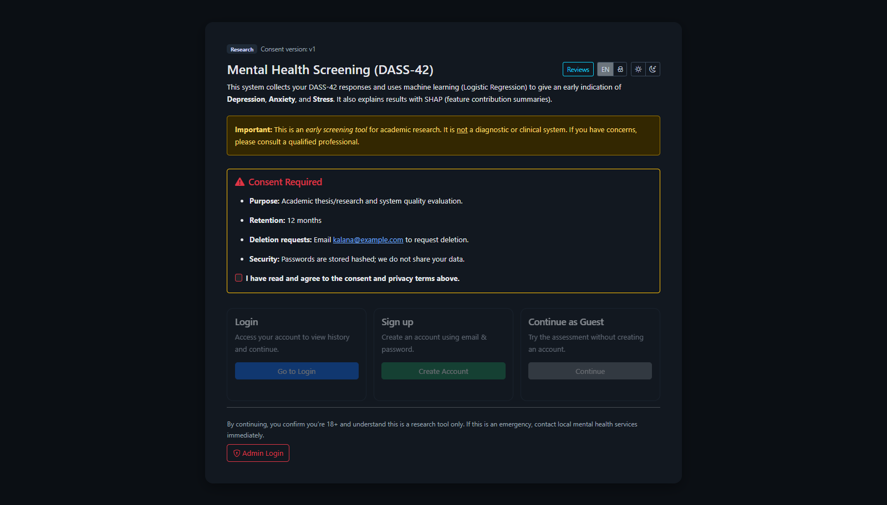
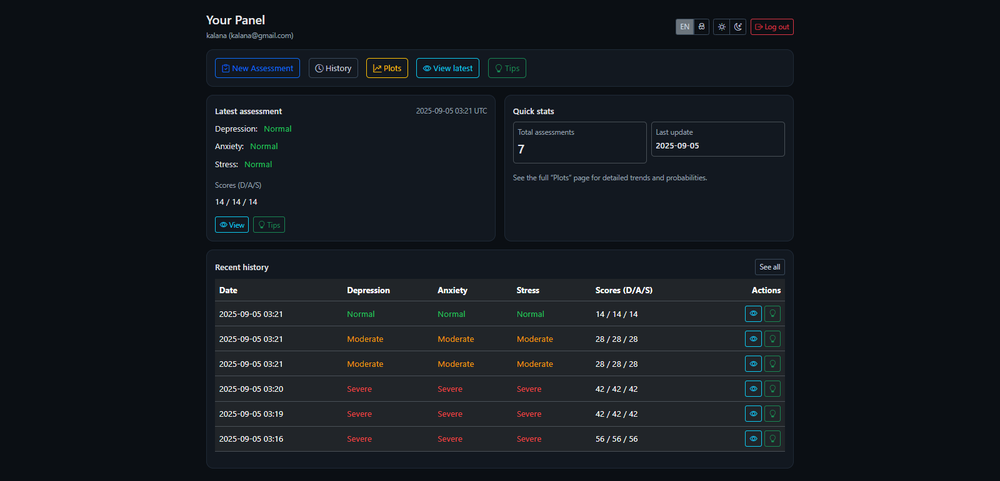
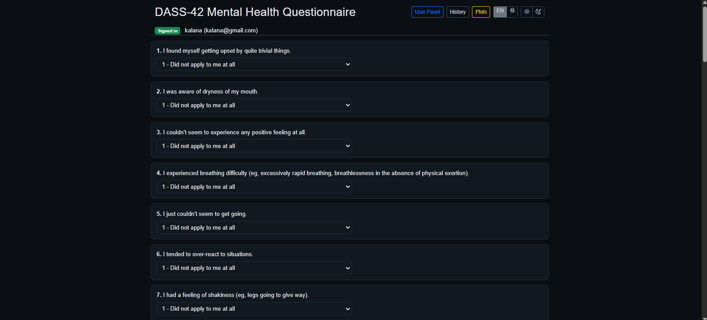
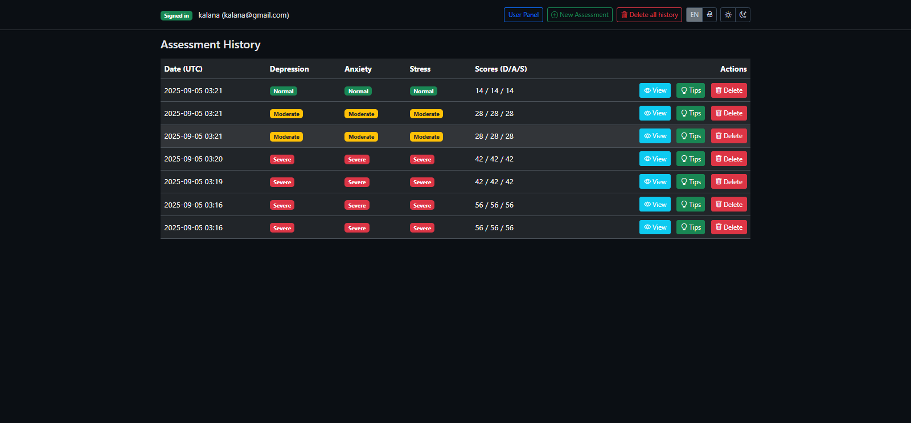

# 🧠 AI-Based Mental Health Screening System

This is a machine learning-powered web application built with **Python, Flask, and SHAP**, designed to screen for **Depression, Anxiety, and Stress** using the standardized **DASS-42** questionnaire. It provides **explainable AI (XAI)** outputs, user history, interactive plots, and bilingual (English/Sinhala) support.

## 🚀 Features
- Predicts **Depression, Anxiety, and Stress** severity levels (Normal / Moderate / Severe).
- Built with **Logistic Regression** and SHAP for transparent predictions.
- Clean and bilingual UI with **light/dark mode** and responsive design.
- Supports **anonymous** mode or **registered accounts** with history tracking.
- Interactive **plots** for trends over time using Plotly.
- Personalized **tips & recommendations** based on results.
- Admin panel for **content management** and **system logs**.

## 🩺 Input Parameters
- DASS-42 questionnaire responses (42 questions)
- Optional: Raw answers for detailed tracking
- User account details (if registered)

## 🧰 Technologies Used
- **Python** – Core development
- **Flask** – Web application framework
- **Pandas, NumPy, Scikit-learn** – Data processing & ML model training
- **SHAP** – Explainable AI visualizations
- **Plotly** – Interactive plots and graphs
- **HTML, CSS, Bootstrap** – Frontend UI
- **Pickle, JSON** – Model & metadata storage

## 📁 Files Included
- `app.py` – Flask app entry point
- `templates/` – HTML templates for pages (home, login, assessment, results, history, tips, admin)
- `static/` – CSS, JavaScript, and images for frontend styling
- `pickle files` – Pickled ML models (`depression.pkl`, `anxiety.pkl`, `stress.pkl`)
- `scaler.pkl` – Preprocessing scaler for consistent inputs
- `dass42_questions.json` – Questionnaire text in English & Sinhala
- `requirements.txt` – Project dependencies
- `README.md` – Project documentation
- `ML_Model.ipynb` – Jupyter notebook for training models

## ⚙️ Installation & Setup
1. Clone the repository:
   ```bash
   git clone https://github.com/YourUsername/AI-Mental-Health-Screening-System.git
   cd AI-Mental-Health-Screening-System
   ```
2. Create virtual environment (optional but recommended):
   ```bash
   python -m venv venv
   venv\Scripts\activate   # For Windows
   # OR
   source venv/bin/activate  # For macOS/Linux
   ```
3. Install dependencies:
   ```bash
   pip install -r requirements.txt
   ```
4. Run the Flask app:
   ```bash
   python app.py
   ```
5. Open your browser and go to `http://127.0.0.1:5000`

## 📂 Dataset
This project uses the DASS-42 questionnaire dataset for model training and evaluation. Make sure the dataset files are in the project root folder if retraining is required.

## 📸 Screenshots





## 🤝 Contribution
Pull requests are welcome! For major changes, please open an issue first to discuss what you'd like to improve.

## 📜 License
This project is licensed under the MIT License – see the `LICENSE` file for details.
